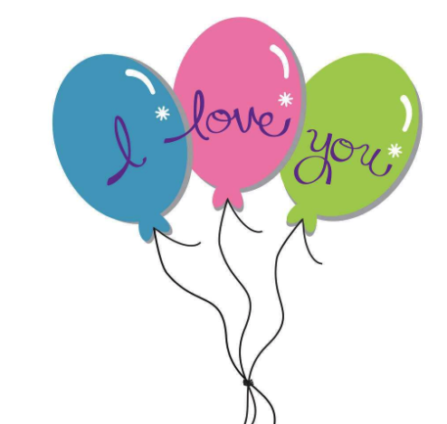
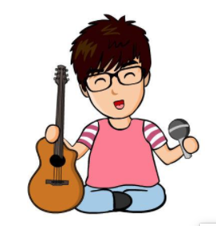
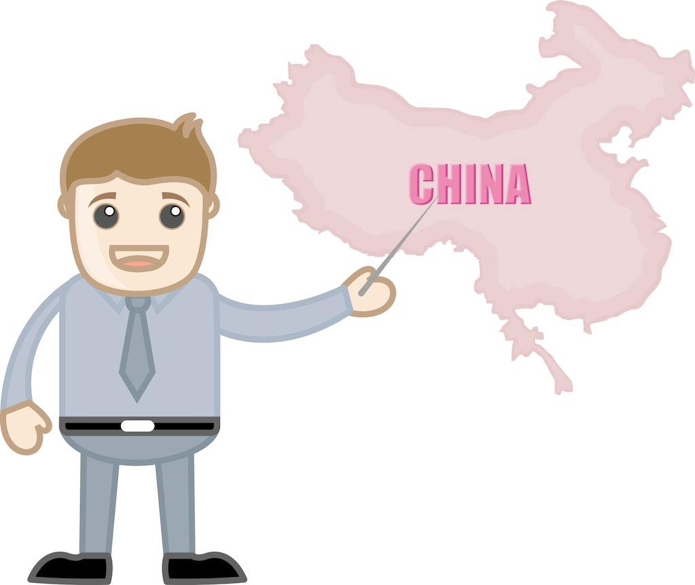
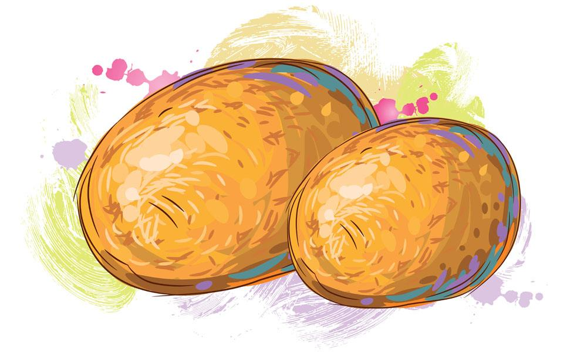
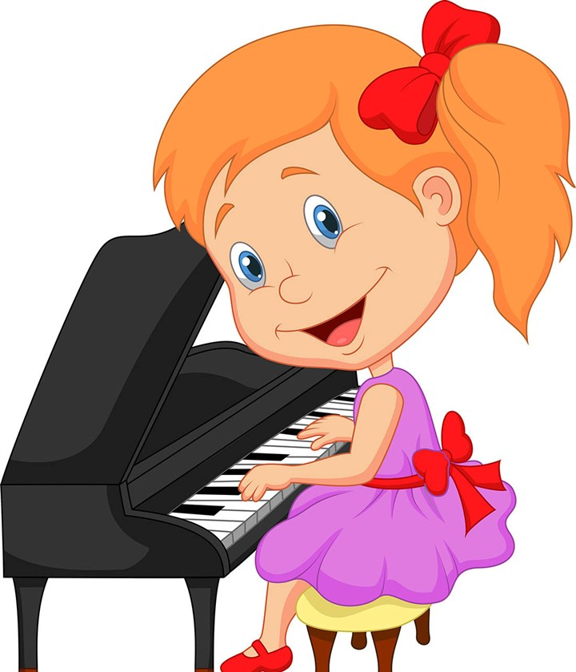

# I love ...

## 句式

I love you. / 我爱你

I love my sister. / 我爱我的妹妹

I love my mum. / 我爱我的妈妈

I love my dad. / 我爱我的爸爸

I love China. / 我爱中国

I love potatoes. / 我爱吃土豆

I love dancing. / 我爱跳舞

I love playing the piano. / 我爱弹钢琴

## 字母学习

    mum / 妈妈

