# I love ...

## 句式

I love you. / 我爱你
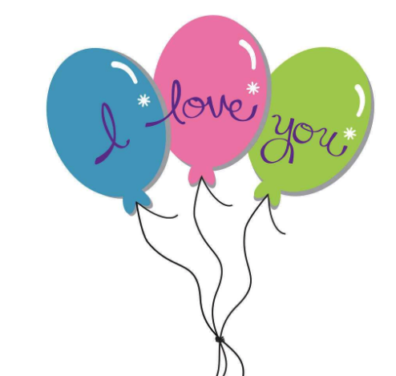

I love my sister. / 我爱我的妹妹

I love my mum. / 我爱我的妈妈
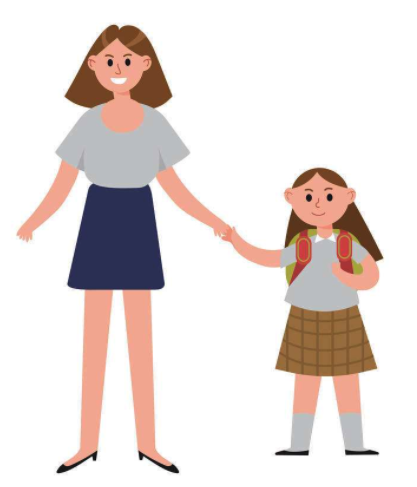

I love my dad. / 我爱我的爸爸
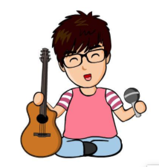

I love China. / 我爱中国

I love potatoes. / 我爱吃土豆
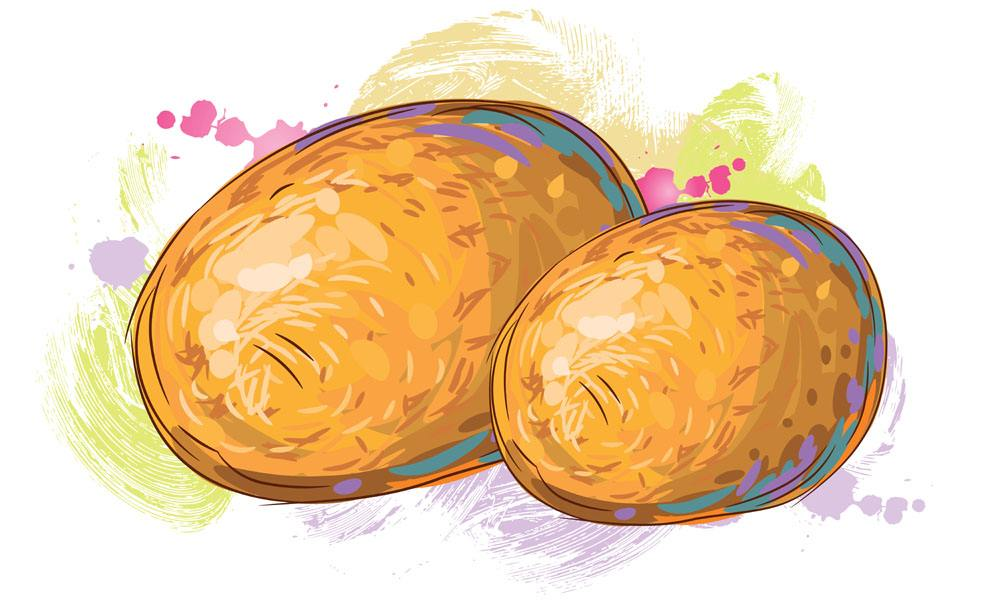

I love dancing. / 我爱跳舞

I love playing the piano. / 我爱弹钢琴
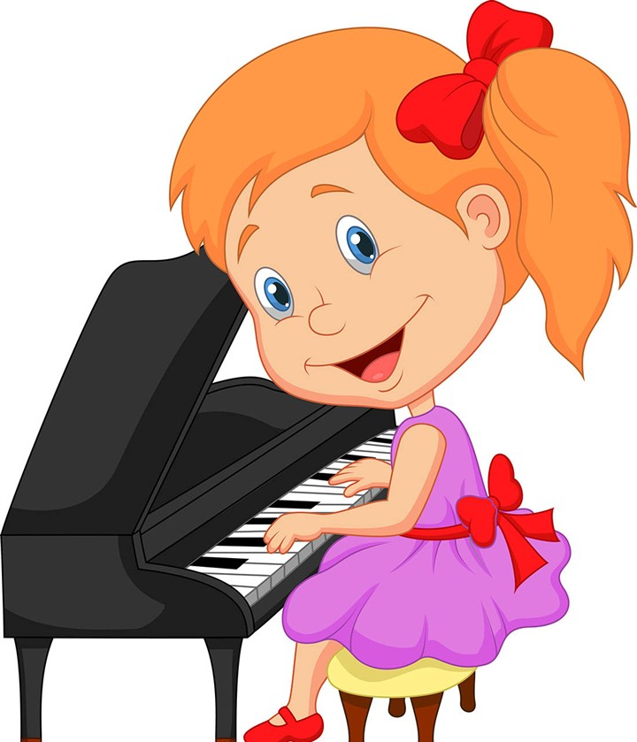

## 识字母

Mm Uu
mum / 妈妈

发音训练
mMUm
UmuU
mUuM
UmUu

# I have a ...

## 句式

I have a rabbit.
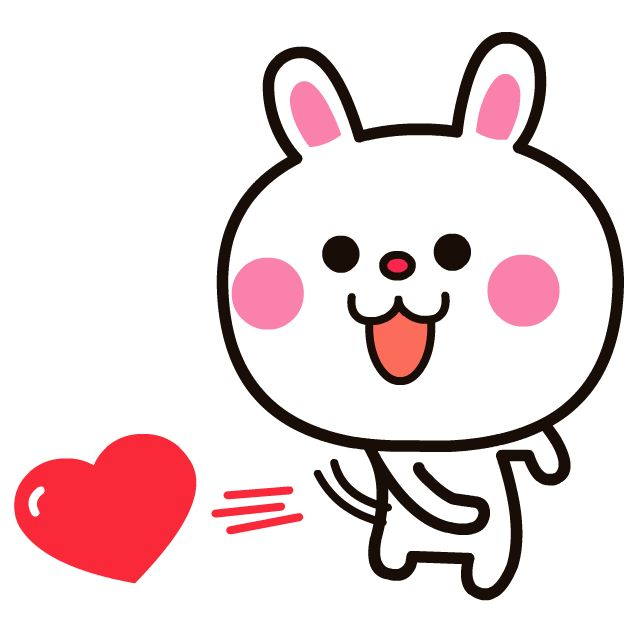

I have a ruler.
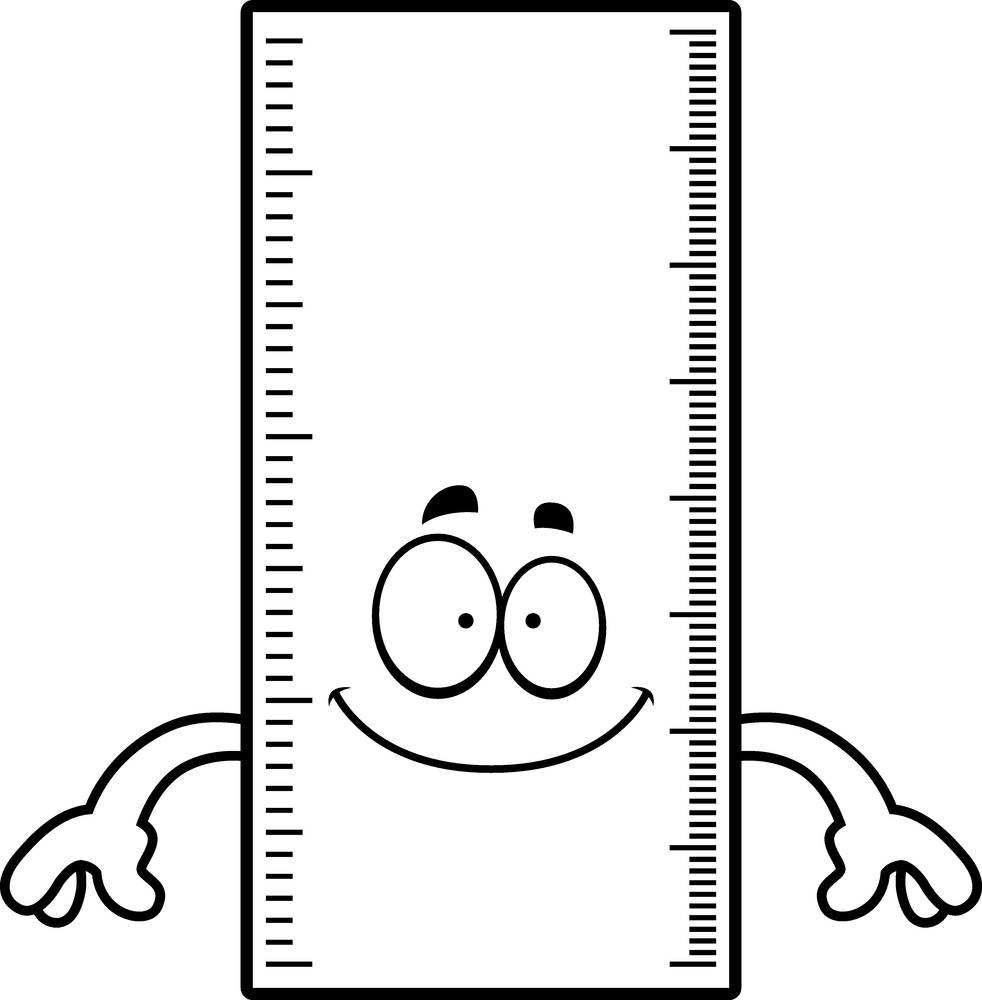

I have a cup.
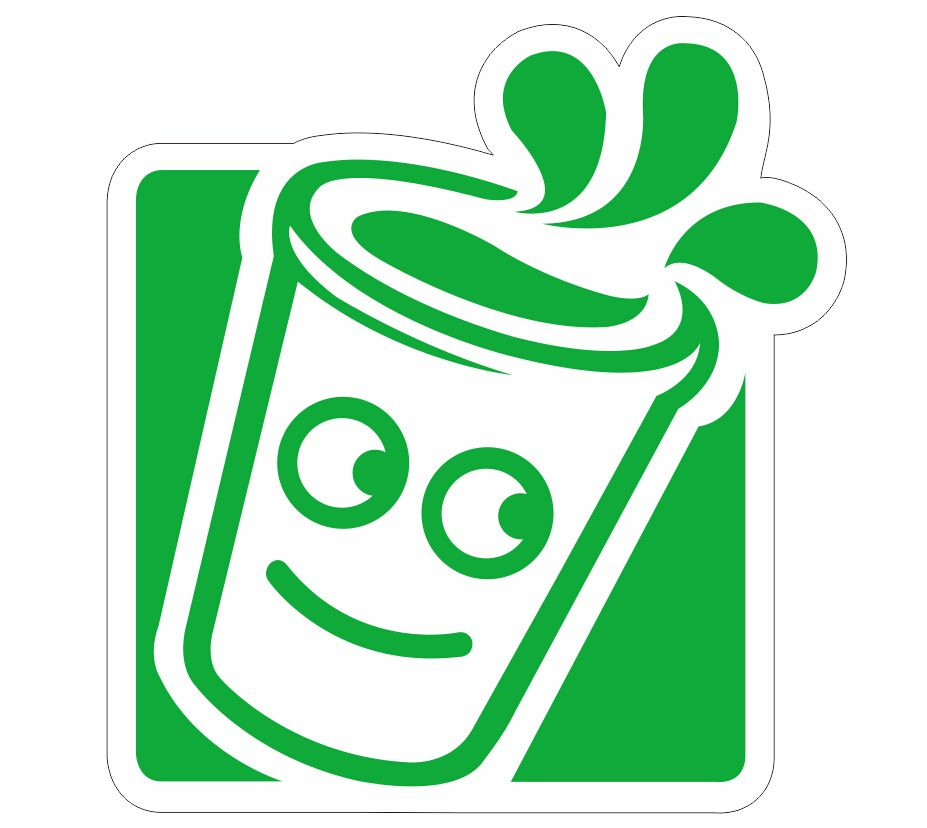

I have a guitar.
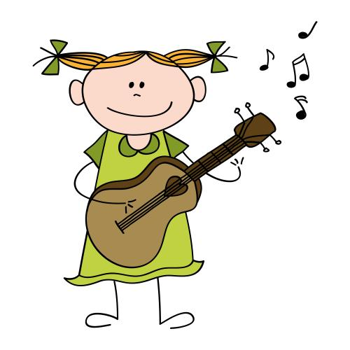

I have a dog.
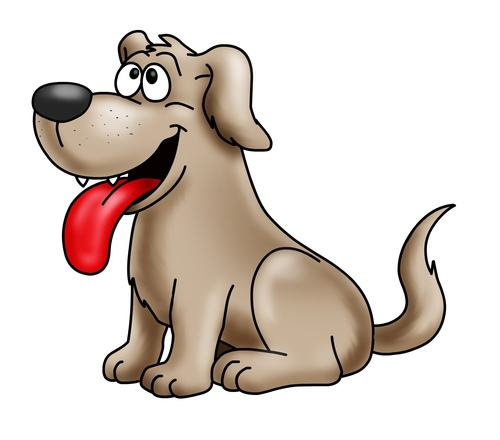

## 造句

cat / 猫
pen / 钢笔
pencil / 铅笔
pencil-box / 文具盒
schoolbag / 书包
pear / 梨
hair clip / 发叉
piano / 钢琴

## 识字母

Aa
a dog / 一个小狗

发音训练：
mAuU
aMmA
uAmU
aAmu
UAuA
mUaM
mAua

# Lession.3 对话

A: Hello, What's your name?
B: My name is Lucy.

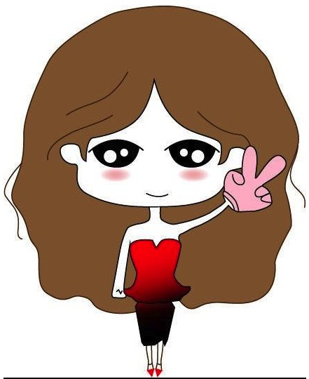

## 造句

What's your name？
My name is _____.

Cassie / Zhang JiaYi / Wang SiCong / Jack Ma / 

## 发音训练

新字母： kK

maAk
ukuM
KaMK
amMK
aMkK
AaUM
KaMu

