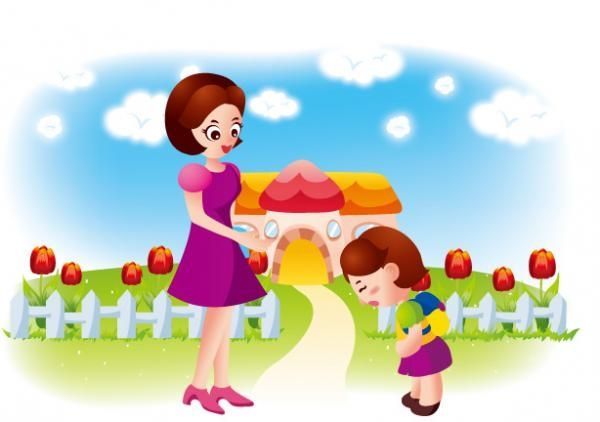
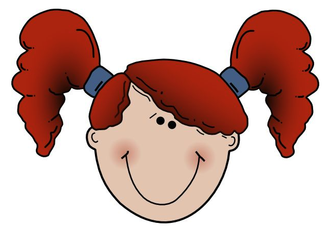
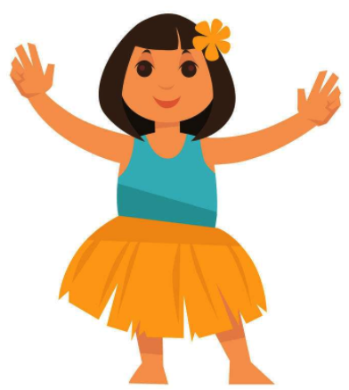

<a href="1.html">上一页</a>

# Lession.5 对话

A: Good morning, Miss Li. 早上好，李老师。
B: Good morning, Lucy. 早上好，Lucy。

## 造句

Good ________ , Cassie.

afternoon / 下午
evening / 晚上

## 发音训练

新字母： bB wW

wWBA
kbop
UPWa
WOoK
aWOo
pUwP
OopU
wPOo
bBaO

# Lession.6 对话

A: Are you Mike？ 你是麦克吗？
B: Yes, I am.  是的，我是。

A: Are you Li Ming? 你是李明吗？
B: No, I'm not. I'm Li Hua. 不，我不是。我是李华。

## 造句

Are you ________ ? 
Yes, I am.

词： Cassie / Dora

Are you _____ ? 
No, I'm not.

词： Ma Yun / Wang JianLin / Lin Zheng Yue E

## 发音训练

新字母： tT eE

tEBa
TbeA
WOwU
KpOu
bBKT
eToa
AuEb
pWbA

# Lession.7 句子

This is Jiayi. 这是佳一。
She's my sister. 她是我的妹妹。

This is Doudou. 这是豆豆。
She's my classmate. 她是我的同班同学。

This is Deng Yilin. 这是邓依林。
She's my schoolmate. 她是我的同学。

## 发音训练

新字母：sS fF / bB wW tT eE Mm Uu kK oO pP

MFPm
Swfs
WFPm
ssuw
EMuW
oFES
stSp
MekF
kFtE
SBOU

<a href="1.html">上一页</a>

firend.
It's a wolf.
sheep.
egg 
fan 扇子

